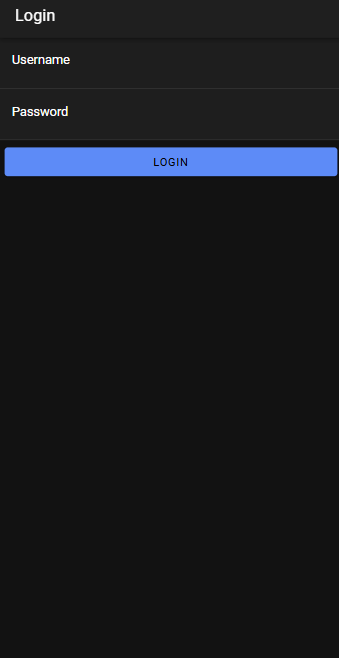

Penjelasan Login

- File `app.module.ts` mendeklarasikan `provideHttpClient`, yang diperlukan agar aplikasi dapat melakukan komunikasi dengan API. Pada `providers`, terdapat `RouteReuseStrategy` dan `provideHttpClient()` untuk mengatur perilaku rute dan menyediakan layanan HTTP.

**Membuat Layanan Autentikasi** 
- `AuthenticationService` adalah layanan yang mengelola proses autentikasi. Ia menggunakan `HttpClient` untuk berkomunikasi dengan API dan `AlertController` untuk menampilkan notifikasi.
- Layanan ini memiliki metode untuk menyimpan token dan data pengguna (`saveData`), memuat data dari penyimpanan (`loadData`), serta menghapus data dari penyimpanan ketika logout (`clearData`).
- `isAuthenticated` adalah `BehaviorSubject` yang menunjukkan apakah pengguna sudah login atau belum. Jika pengguna sudah login, nilainya diubah menjadi `true`.
- `postMethod` digunakan untuk mengirim data login ke API melalui metode `POST`.
- `notifikasi` adalah metode yang menampilkan notifikasi dengan pesan yang diberikan.
- `apiURL` berisi URL dasar API.
- `logout` berfungsi untuk mengatur `isAuthenticated` menjadi `false` dan membersihkan data autentikasi pengguna.

**Menambahkan Guard untuk Autentikasi**
- **`authGuard`** memastikan pengguna telah login sebelum mengakses halaman tertentu. Jika pengguna belum login, maka akan diarahkan ke halaman login.
- **`autoLoginGuard`** mencegah pengguna yang sudah login untuk mengakses halaman login kembali. Jika pengguna sudah login, mereka diarahkan ke halaman utama (`/home`).

**Konfigurasi Rute Aplikasi**
- Di sini, guard ditambahkan pada rute `home` untuk memastikan pengguna harus login (`authGuard`) sebelum mengaksesnya. Pada rute `login`, `autoLoginGuard` digunakan untuk mengarahkan pengguna yang sudah login ke halaman `home`.

**Membuat Halaman Login**
- **`login.page.html`** menyediakan tampilan form login dengan input untuk username dan password serta tombol `Login`.
- **`login.page.ts`** adalah komponen yang mengelola fungsi login. Ketika pengguna mengklik tombol login, `login()` dijalankan:
- Jika username dan password diisi, data dikirim ke API menggunakan `postMethod`.
- Jika respons `status_login` adalah "berhasil", `saveData` dipanggil untuk menyimpan token dan username, lalu pengguna diarahkan ke halaman `home`.
- Jika login gagal, notifikasi akan ditampilkan sesuai pesan error (contoh: "Username atau Password Salah" atau "Login Gagal Periksa Koneksi Internet Anda").

Proses login ini memastikan autentikasi yang aman dengan menggunakan token dan menyimpan data login secara lokal. Guard memastikan akses halaman tertentu hanya tersedia bagi pengguna yang sudah login.